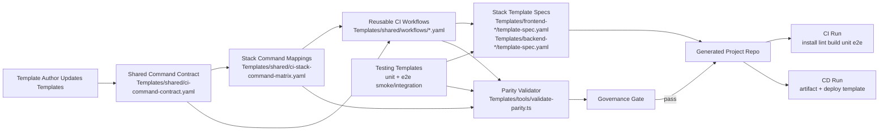

# CI/CD and Testing Templates Architecture (Stage 2)

## System Overview
This feature adds reusable CI/CD action templates plus unit-test and E2E testing templates so generated projects are testable from day one and feature validation is fast, consistent, and stack-agnostic.

Scope includes:
- Shared workflow template pattern (not stack-only duplication)
- CI templates for lint/build/unit/E2E orchestration
- CD templates including deployment workflow skeletons
- Unit and E2E test templates (frontend browser E2E, backend API smoke/integration)
- Shared command contract with per-stack command mappings
- Governance checks integrated with existing parity tooling

Out of scope:
- Provisioning cloud infrastructure
- Replacing stack-native test frameworks
- Runtime deployment credentials management for real environments

## Assumptions and Inputs
- Stage 1 decisions are final for this stage:
  - Shared reusable workflow pattern is required.
  - CD includes deployment templates.
  - Backend E2E is satisfied by API smoke/integration tests.
  - Shared command contract with per-stack mappings is required.
- Existing governance controls remain active:
  - `Templates/shared/capability-parity-matrix.yaml`
  - `Templates/tools/validate-parity.ts`
- Existing unstaged edits in parity files must be preserved.

## Architecture Diagram


## Component Breakdown

### 1) Shared Command Contract
- Responsibility: Define canonical CI/CD lifecycle command slots (`install`, `lint`, `build`, `unit_test`, `e2e_test`, `package`, `deploy`) that all stacks map to.
- Interfaces: YAML schema-like contract consumed by reusable workflows and stack mapping.
- Dependencies: Stack catalog for stack keys.
- Technology: YAML in `Templates/shared/`.

### 2) Stack Command Mapping Matrix
- Responsibility: Map each stack key (nextjs, sveltekit, angular, node_nestjs, dotnet, python, go, java, rust) to concrete commands for each contract slot.
- Interfaces: Referenced by workflow templates at generation time.
- Dependencies: Shared command contract, stack catalog.
- Technology: YAML matrix file in `Templates/shared/`.

### 3) Reusable Workflow Templates (CI)
- Responsibility: Provide generic workflow templates for pull request and main-branch validation using contract slots.
- Interfaces: Inputs are stack key, command matrix, and project metadata.
- Dependencies: Shared command contract, mapping matrix.
- Technology: YAML templates under `Templates/shared/workflows/`.

### 4) Reusable Workflow Templates (CD + Deployment)
- Responsibility: Provide release/deploy workflow templates with environment placeholders and promotion gates.
- Interfaces: Inputs include deployment target profile and package artifact metadata.
- Dependencies: CI outputs and command contract `package`/`deploy` slots.
- Technology: YAML templates under `Templates/shared/workflows/`.

### 5) Unit-Test Templates
- Responsibility: Ensure every generated project includes a starter unit test and runner configuration path.
- Interfaces: Stack-native framework scaffold references from stack template specs.
- Dependencies: Stack-specific template specs.
- Technology: Markdown/YAML guidance in template specs and scaffold files.

### 6) E2E Test Templates
- Responsibility: Ensure every generated project includes starter E2E coverage.
- Frontend: Browser E2E happy-path template.
- Backend: API smoke/integration template (as decided in Stage 1).
- Interfaces: Referenced by CI `e2e_test` slot.
- Dependencies: Stack-native test runners.

### 7) Governance and Validation
- Responsibility: Detect drift, missing mappings, and missing test/deployment capabilities before template changes are accepted.
- Interfaces: `node --test Templates/tools/validate-parity.test.ts` and parity validator CLI.
- Dependencies: Existing parity files plus new CI/CD matrix and workflow references.

### 8) Documentation and Adoption
- Responsibility: Make the workflow and command contract discoverable in repo-level docs.
- Interfaces: `README.md` and `Templates/README.md` updates.
- Dependencies: Finalized contract and file layout.

## Deployment Topology
Because this feature ships repository templates (not runtime services), deployment topology is represented as control planes:
- Authoring plane: Contributors edit `Templates/**` and docs.
- Validation plane: Local/CI runs `npm run templates:test-parity` and `npm run templates:validate-parity`.
- Consumption plane: Scaffold/generation process copies selected workflow/testing templates into generated projects.
- Runtime plane: Generated project CI/CD system executes stack-native commands and deployment placeholders.

Network/trust boundaries:
- Internal repository boundary: template source and validator.
- External CI provider boundary: execution of workflows and use of secrets in generated projects.
- Optional deployment target boundary: environments referenced by deployment templates.

## API Contract Specification
This feature uses file-based contracts rather than HTTP APIs.

### Contract A: CI Command Slot Definition
- File: `Templates/shared/ci-command-contract.yaml`
- Purpose: Canonical slot names and required/optional semantics.

Example:
```yaml
version: 1.0.0
name: ci-command-contract
slots:
  install: { required: true }
  lint: { required: true }
  build: { required: true }
  unit_test: { required: true }
  e2e_test: { required: true }
  package: { required: true }
  deploy: { required: true }
```

### Contract B: Per-Stack Command Mapping
- File: `Templates/shared/ci-stack-command-matrix.yaml`
- Purpose: Concrete commands per stack key and slot.

Example:
```yaml
version: 1.0.0
stacks:
  nextjs:
    install: npm ci
    lint: npm run lint
    build: npm run build
    unit_test: npm run test:unit
    e2e_test: npm run test:e2e
    package: npm pack
    deploy: echo "configure deployment target"
```

### Contract C: Reusable Workflow Interface
- Files: `Templates/shared/workflows/ci.yaml`, `Templates/shared/workflows/cd.yaml`
- Purpose: Document required inputs and outputs for workflow generation.

Example inputs:
- `stack_key`
- `working_directory`
- `artifact_name`
- `deploy_environment`

Example output:
- Workflow files generated with concrete commands and stage gates.

## Data Model
Primary entities:
- `CommandSlot`: canonical lifecycle step identifier.
- `StackCommandMap`: mapping from stack key to command strings keyed by slot.
- `WorkflowTemplate`: reusable workflow document with placeholders for stack and environment.
- `TestTemplate`: unit/E2E starter template metadata.
- `ValidationRule`: parity and schema checks enforced in tooling.

Relationships:
- One `CommandSlot` set is shared by all stacks.
- Each stack has one `StackCommandMap` referencing all required slots.
- Workflows reference stack maps by stack key.
- Validation rules verify completeness across slots, stacks, and capabilities.

## Integration Points
- Existing template specs:
  - `Templates/frontend-nextjs/template-spec.yaml`
  - `Templates/frontend-sveltekit/template-spec.yaml`
  - `Templates/frontend-angular/template-spec.yaml`
  - `Templates/backend-service/template-spec.yaml`
  - `Templates/backend-dotnet/template-spec.yaml`
  - `Templates/backend-python/template-spec.yaml`
  - `Templates/backend-go/template-spec.yaml`
  - `Templates/backend-java/template-spec.yaml`
  - `Templates/backend-rust/template-spec.yaml`
- Existing governance artifacts:
  - `Templates/shared/capability-parity-matrix.yaml`
  - `Templates/shared/stack-catalog.yaml`
  - `Templates/tools/validate-parity.ts`

## Non-Functional Requirements
- Performance:
  - Validator execution should remain fast enough for local pre-commit and CI checks.
- Scalability:
  - Adding a new stack should require adding only one stack mapping entry and spec updates.
- Reliability:
  - Generated project must have deterministic test commands and repeatable CI paths.
- Security:
  - Deployment templates must avoid hardcoded secrets and enforce secret placeholders.
- Maintainability:
  - Shared workflow pattern minimizes duplication and stack drift.

## Security Threat Model (STRIDE)
Trust boundaries:
- Boundary 1: Template repository maintainers vs CI execution environment.
- Boundary 2: CI execution environment vs deployment targets.
- Boundary 3: Generated repository contributors vs protected environments.

Threats and mitigations:
- Spoofing:
  - Risk: Unauthorized workflow invocation against protected deployment environments.
  - Mitigation: Environment protection rules and required approvals in deployment templates.
  - Residual risk: Misconfigured branch/environment protections in downstream repos.
- Tampering:
  - Risk: Template changes silently alter deploy commands.
  - Mitigation: Parity validation + required code review + change visibility in central templates.
  - Residual risk: Maintainer-approved but unsafe command edits.
- Repudiation:
  - Risk: Unclear attribution for deployment-triggering template changes.
  - Mitigation: Commit history + CI logs + required review checks.
  - Residual risk: Downstream repos with weak audit retention.
- Information Disclosure:
  - Risk: Secrets printed in CI logs.
  - Mitigation: Placeholder-based secret references, no plaintext defaults, documented redaction guidance.
  - Residual risk: Stack-specific scripts may echo secrets if miswritten.
- Denial of Service:
  - Risk: Excessive test matrix expansion makes CI non-viable.
  - Mitigation: Reusable workflow controls (path filters, concurrency, selective triggers).
  - Residual risk: Large monorepo changes still cause long CI durations.
- Elevation of Privilege:
  - Risk: Deploy workflow has over-broad permissions.
  - Mitigation: Principle of least privilege in workflow permissions and scoped tokens.
  - Residual risk: Consumer repos may widen permissions.

## Observability Architecture
For template validation and generated workflows:
- Logging:
  - Structured validator errors include file path, message, and hint.
  - Redaction policy: never log secret values; log only secret variable names.
- Metrics (candidate SLIs/SLOs):
  - SLI: template parity validation pass rate.
  - SLI: generated project first-run CI success rate.
  - SLO target candidates:
    - >= 99% parity validation determinism on main.
    - >= 95% first-run CI success for newly generated projects.
- Tracing/correlation:
  - Include run ID and stack key in generated workflow logs.
  - Propagate correlation ID from workflow entry to test/deploy steps where possible.
- Alert anchors:
  - Alert on parity validator failures on protected branches.
  - Alert on deployment template failures by environment.

## Dependency Risk Analysis
- Node tooling dependencies (`yaml`, `ajv`) in parity validator:
  - Risk: version drift or CVEs.
  - Mitigation: pin versions, periodic dependency updates, CI security scanning.
- CI platform workflow syntax:
  - Risk: lock-in to workflow syntax conventions.
  - Mitigation: keep command contract platform-neutral and isolate provider details in shared workflow templates.
- Stack-native test tools:
  - Risk: uneven maturity across stack test ecosystems.
  - Mitigation: define minimum command contract and starter templates for every stack.

## Architecture Decision Records (ADRs)

### ADR-001: Use shared reusable workflow templates
- Context: Need consistency across nine stack templates without high maintenance overhead.
- Decision: Define shared CI/CD workflow templates with stack command mapping indirection.
- Consequences:
  - Positive: Lower duplication, easier governance, consistent rollout of changes.
  - Negative: Requires clear contract/matrix design and robust validation.
- Alternatives considered:
  - Stack-specific independent workflows per template (rejected due to drift risk and maintenance cost).

### ADR-002: Adopt command-slot contract with per-stack mappings
- Context: Need concrete commands without stack lock-in.
- Decision: Introduce canonical command slots and maintain explicit per-stack command matrix.
- Consequences:
  - Positive: Balances abstraction with concrete executability.
  - Negative: Requires matrix updates for every new stack or command-slot change.
- Alternatives considered:
  - Hardcode commands directly in each workflow (rejected due to duplication and weak governance).

### ADR-003: Include deployment templates in CD scope now
- Context: Stage 1 confirmed deployment templates are required for this feature.
- Decision: Include CD deploy template artifacts in Stage 2 architecture and Stage 3 implementation backlog.
- Consequences:
  - Positive: New projects have an end-to-end delivery baseline from day one.
  - Negative: Requires careful security defaults and environment documentation.
- Alternatives considered:
  - CI-only scope with deferred deployment templates (rejected due to explicit requirement).

### ADR-004: Define backend E2E as API smoke/integration baseline
- Context: Backend stacks vary; browser-style E2E does not apply uniformly.
- Decision: Treat backend E2E requirement as API smoke/integration suite templates.
- Consequences:
  - Positive: Clear, portable backend validation baseline.
  - Negative: Not full system end-to-end for complex distributed behavior.
- Alternatives considered:
  - Full environment integration E2E for all backends (rejected as too heavy for template baseline).

## Cross-Cutting Concerns
- Authentication/Authorization: out of scope for template runtime implementation; deployment templates must assume protected secret access paths.
- Rate limiting: out of scope for this repository feature; stack templates may include runtime guidance separately.
- Idempotency: CI and CD templates should be safe to re-run and avoid destructive non-idempotent defaults.
- Data retention: CI artifact and log retention should be parameterized in deployment workflow templates.

## Traceability to Stage 1 Decisions
- Shared reusable workflow pattern: covered by ADR-001 and Components 1 to 4.
- CD includes deployment templates: covered by ADR-003 and Component 4.
- Backend E2E as API smoke/integration: covered by ADR-004 and Component 6.
- Shared command contract + per-stack mappings: covered by ADR-002 and Components 1 to 2.

## Stage 2 Gate Self-Check
- Mermaid diagram included: Yes
- Architecture decisions documented: Yes (ADR-001 through ADR-004)
- Components mapped for backlog decomposition: Yes (8 components)
