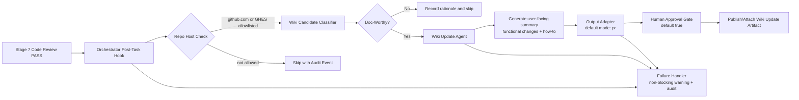

# Wiki Update Agent Architecture (Stage 2)

## Feasibility Assessment (COMPLEX Gate)
Recommendation: Go.

Unknowns and assumptions:
- Unknown: Exact detection mechanism for GHES host trust (config file vs environment variable source).
- Assumption: GHES allowlist is declared in shared template contract and consumed by orchestrator/runtime agents.
- Unknown: Final wiki write path (PR body/comment artifact vs direct wiki commit).
- Assumption: Default `outputMode: pr` means generated markdown is attached to PR-oriented output instead of direct wiki writes.

Highest-risk assumptions:
- Classification quality can become noisy if rules are too broad.
- Shared contract drift can occur if stack specs and validator rules are not versioned together.

Go/No-Go:
- Go with contract-first design, strict defaults, and parity gate checks to limit drift and noisy updates.

## System Overview
This feature adds a post-task wiki update flow that runs only after Stage 7 PASS and only for GitHub-hosted repositories (`github.com` and allowlisted GHES hosts). The flow determines whether a completed task is worth end-user documentation, drafts concise user-facing wiki content, and emits non-blocking warnings/audit records on failures.

Scope includes:
- Post-Stage-7 orchestrator hook for wiki-update evaluation.
- A wiki update agent specification focused on end-user functional and how-to guidance.
- Shared scaffold/contract fields so all stacks can consistently opt into wiki update behavior.
- Parity validation checks for new contract fields and stack coverage.

Out of scope:
- Direct implementation of wiki publishing APIs in this stage.
- Migration of historical tasks into wiki updates.
- Non-GitHub SCM support.

## Architecture Diagram


## Component Breakdown

### 1) Orchestrator Post-Task Trigger
- Responsibility: Invoke wiki update flow after Stage 7 PASS only.
- Interfaces: Pipeline stage outcome event, task metadata, repository metadata.
- Dependencies: Orchestrator stage state and review gate result.
- Technology: Agent orchestration markdown/spec behavior.

### 2) Repository Host Policy Contract
- Responsibility: Enforce SCM scope and allowlist behavior.
- Interfaces: Shared YAML contract fields (`scope`, `ghesAllowlist`, `trigger`, `failureMode`, `outputMode`, `humanApproval`).
- Dependencies: Shared contract files in `templates/shared/`.
- Technology: YAML contract and parity validation.

### 3) Wiki Candidate Classifier
- Responsibility: Decide if a task is worth end-user wiki documentation.
- Interfaces: Completed task summary, changed artifacts, acceptance criteria status.
- Dependencies: Classification rubric and exclusion rules.
- Technology: Agent prompt/spec rules.

### 4) Wiki Update Agent
- Responsibility: Produce wiki-ready markdown centered on user-visible functional changes and practical how-to guidance, excluding low-level internals.
- Interfaces: Classified task context package and output mode adapter.
- Dependencies: Classifier output and policy contract defaults.
- Technology: Markdown-based agent spec.

### 5) Output Adapter and Approval Gate
- Responsibility: Route generated content to `pr` output mode and enforce human approval default.
- Interfaces: PR-oriented artifact output and approval state.
- Dependencies: Repo host policy contract and pipeline event context.
- Technology: Orchestrator-compatible output contract.

### 6) Scaffold Contract Propagation
- Responsibility: Ensure template specs consistently declare wiki update support defaults.
- Interfaces: Template spec fields and shared contract references.
- Dependencies: `templates/shared/*` source-of-truth files.
- Technology: YAML template specs across stacks.

### 7) Parity Validation and Governance
- Responsibility: Detect drift between shared wiki contract, stack template specs, and validation rules.
- Interfaces: `templates/tools/validate-parity.ts` and tests.
- Dependencies: Capability matrix, stack catalog, and new wiki fields.
- Technology: Node test runner (`node --test`) and parity tooling.

## Deployment Topology
This feature is template/orchestration behavior, not a deployable runtime service.

Topology planes:
- Authoring plane: contributors edit agent specs, shared contracts, and stack template specs.
- Validation plane: parity validator and tests run in CI/local npm scripts.
- Orchestration plane: pipeline orchestrator triggers post-task wiki update after Stage 7 PASS.
- Consumption plane: generated or maintained repositories receive PR-mode wiki update artifacts pending human approval.

Trust boundaries:
- Boundary A: Internal template repository maintainers.
- Boundary B: GitHub/GHES repository metadata and PR surfaces.
- Boundary C: Human approver and publish action.

## API Contract Specification
This feature uses file-based contracts.

### Contract A: Wiki Update Policy Contract
- File: `templates/shared/wiki-update-contract.yaml`
- Purpose: Define defaults and enforcement scope for wiki update behavior.

Example:
```yaml
version: 1.0.0
name: wiki-update-contract
policy:
  scope:
    githubDotCom: true
    ghesAllowlist: []
  trigger: stage7_pass
  failureMode: non_blocking_warning_audit
  outputMode: pr
  humanApproval: true
classification:
  include:
    - user_visible_functional_change
    - end_user_how_to
  exclude:
    - internal_refactor_only
    - low_level_framework_details
```

### Contract B: Stack Wiki Scaffold Support
- Files: `templates/*/template-spec.yaml`
- Purpose: Declare that each stack scaffold supports wiki update metadata and shared contract linkage.

Example:
```yaml
wiki_update:
  enabled: true
  contract_ref: templates/shared/wiki-update-contract.yaml
  output_mode_default: pr
  human_approval_default: true
```

### Contract C: Parity Validation Rules
- Files: `templates/shared/capability-parity-matrix.yaml` and validator logic.
- Purpose: Enforce required wiki update support fields for every stack key.

## Data Model
Primary entities:
- `WikiUpdatePolicy`: scope, trigger, failure mode, output mode, approval defaults.
- `RepoHostContext`: detected host, host type (`github.com`, `ghes`, `other`), allowlist match.
- `WikiCandidateDecision`: `eligible` boolean, reason code, confidence/rationale.
- `WikiUpdateArtifact`: title, summary, functional change list, how-to steps, exclusions.
- `WikiAuditEvent`: task ID, stage, action, outcome, warning/error details.

Relationships:
- One `WikiUpdatePolicy` applies to many stacks via contract reference.
- Each completed task yields one `WikiCandidateDecision`.
- Eligible decisions produce one or more `WikiUpdateArtifact` outputs.
- Every flow action emits `WikiAuditEvent` records.

## Integration Points
- Pipeline state and stage outcomes:
  - `agent-progress/pipeline-wiki-update-agent.md`
  - `agents/orchestrator.agent.md`
- Shared template source-of-truth:
  - `templates/shared/platform-contracts.yaml`
  - `templates/shared/capability-parity-matrix.yaml`
  - `templates/shared/stack-catalog.yaml`
- Validation tooling:
  - `templates/tools/validate-parity.ts`
  - `templates/tools/validate-parity.test.ts`

## Non-Functional Requirements
- Performance:
  - Post-Stage-7 evaluation should complete quickly and not materially delay pipeline completion.
- Reliability:
  - Failure path is explicitly non-blocking and must always emit warning/audit output.
- Maintainability:
  - Contract-first defaults avoid repeated stack-by-stack interpretation.
- Scalability:
  - New stacks integrate by adding template fields and passing parity checks.
- Usability:
  - Generated wiki content prioritizes end-user outcomes and actionable steps.

## Security Threat Model (STRIDE)
Trust boundaries:
- Boundary 1: Internal orchestrator context to external repo host metadata.
- Boundary 2: Generated documentation artifact to PR/wiki publication surface.
- Boundary 3: Automation output to human approval step.

Threats and mitigations:
- Spoofing:
  - Threat: Host metadata spoofing causes unauthorized wiki update attempts.
  - Mitigation: Strict host normalization and explicit allowlist match.
  - Residual risk: Misconfigured allowlist entries.
- Tampering:
  - Threat: Wiki artifact content altered between generation and approval.
  - Mitigation: Immutable artifact checksum in audit trail and PR-linked provenance.
  - Residual risk: Manual edits after generation.
- Repudiation:
  - Threat: Inability to prove why a wiki update was skipped or published.
  - Mitigation: Required reason codes and audit events for all decisions.
  - Residual risk: Incomplete downstream log retention.
- Information Disclosure:
  - Threat: Internal implementation details leak into end-user wiki content.
  - Mitigation: Classifier exclusion rules and output lint checks for internal-only markers.
  - Residual risk: Edge-case misclassification.
- Denial of Service:
  - Threat: Repeated classifier retries create pipeline noise.
  - Mitigation: Single-attempt non-blocking behavior with warning and no hard fail.
  - Residual risk: Increased warning volume until rules are tuned.
- Elevation of Privilege:
  - Threat: Automation bypasses required human approval.
  - Mitigation: Contract default `humanApproval: true` and gate enforcement.
  - Residual risk: Consumer override without governance review.

## Observability Architecture
- Logging:
  - Structured fields: `taskId`, `stage`, `repoHost`, `allowlistMatch`, `candidateDecision`, `reasonCode`, `outputMode`, `approvalRequired`, `result`.
  - Redaction: do not log auth tokens, secrets, or full private repo URLs beyond host.
- Metrics (SLI/SLO candidates):
  - SLI: wiki candidate precision proxy (approved updates / generated updates).
  - SLI: non-blocking failure rate.
  - SLO candidates:
    - >= 95% of generated wiki updates approved without major rewrite.
    - 100% of failures produce warning + audit event.
- Tracing:
  - Correlation by `taskId` from Stage 7 outcome through wiki flow.
- Alert anchors:
  - Alert if failure events occur without corresponding audit entries.
  - Alert on sudden spike in `not_doc_worthy` or `internal_only` decisions.

## Dependency Risk Analysis
- Dependence on GitHub/GHES host detection:
  - Risk: inconsistent host parsing across environments.
  - Mitigation: central parsing utility contract and test vectors.
- Dependence on parity tooling:
  - Risk: contract evolves without validator updates.
  - Mitigation: version bump policy and parity tests as merge gate.
- Dependence on classifier rubric quality:
  - Risk: noisy or missed wiki opportunities.
  - Mitigation: explicit include/exclude taxonomy and periodic calibration.

## Architecture Decisions (ADRs)

### ADR-001: Trigger Wiki Update Only After Stage 7 PASS
- Context: Avoid publishing documentation for unreviewed or failing work.
- Decision: Execute wiki update evaluation only after Stage 7 PASS.
- Consequences: Higher documentation quality, but delayed artifact generation.
- Alternatives considered:
  - Trigger after Stage 4 implementation: rejected due to review/test instability.
  - Trigger after Stage 6 docs gate: rejected because Stage 7 can still fail.

### ADR-002: Restrict Scope to GitHub.com and Allowlisted GHES
- Context: Feature requires predictable repo host semantics.
- Decision: Support only `github.com` and explicitly allowlisted GHES hosts.
- Consequences: Safer rollout, but excludes non-GitHub SCM users.
- Alternatives considered:
  - Support all git remotes: rejected due to ambiguous auth and API behavior.

### ADR-003: Non-Blocking Failure Mode with Warning and Audit
- Context: Documentation sidecar should not block delivery pipeline.
- Decision: Failure emits warning/audit and does not fail pipeline.
- Consequences: Delivery continuity preserved; requires monitoring to prevent silent quality decay.
- Alternatives considered:
  - Blocking on wiki update failure: rejected as too disruptive.

### ADR-004: Default Output Mode `pr` with Human Approval `true`
- Context: Need safe publication and operator control.
- Decision: Generate PR-oriented artifact and require human approval by default.
- Consequences: Adds review step; lowers accidental publication risk.
- Alternatives considered:
  - Auto-publish mode default: rejected due to governance risk.

### ADR-005: Contract-First Scaffold Support with Parity Enforcement
- Context: Stack consistency is a stated acceptance criterion.
- Decision: Add shared wiki contract + stack spec fields validated by parity tooling.
- Consequences: More up-front schema work; significantly reduced drift risk.
- Alternatives considered:
  - Stack-local ad hoc fields only: rejected due to likely drift.
