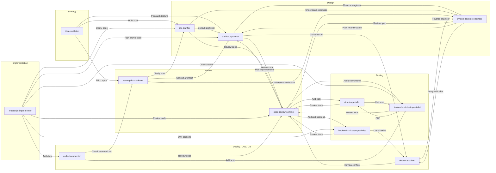

# cuddly-robot

A Repo of the custom Cursor or VS Code Agents I have created.

## Adding agents in Cursor and VS Code

### Cursor

Agents are loaded from the workspace. To use these agents in Cursor:

1. **Use this repo as your workspace** — Open the `cuddly-robot` folder in Cursor. The agents in `.vscode/agents/` (files named `*.agent.md`) appear in the agent picker in Chat (e.g. Cmd/Ctrl+I or the agent dropdown).
2. **Use in another project** — Copy the `.vscode/agents` folder from this repo into your project’s `.vscode/` directory. After you open that project in Cursor, the agents show up in the picker.

No extra config is required; Cursor discovers `.agent.md` files under `.vscode/agents/` in the open workspace.

### VS Code (with Copilot / AI chat)

VS Code custom agents use the same `.agent.md` format but look in different places by default:

1. **Default location** — VS Code looks for custom agents in **`.github/agents`** in your workspace (not `.vscode/agents`). To use this repo’s agents in a project:
   - Copy the contents of this repo’s `.vscode/agents/` into your project’s **`.github/agents/`** (create the folder if needed), or
   - Keep the files as `.agent.md`; only the folder path differs.
2. **Custom agent locations** — To load agents from another path (e.g. this repo or a shared folder), set **`chat.agentFilesLocations`** in VS Code settings (or `chat.copilot.chat.agentFilesLocations` depending on your version) to include that path. Then VS Code will discover `.agent.md` files there as well.

To manage agents: run **“Chat: Open Chat Customizations”** from the Command Palette, or type `/agents` in chat. You can show/hide agents in the dropdown from there.

---

## Flows

### 1. Specialist handoffs (agent-to-agent)

Agents can hand off to other agents via the **handoffs** defined in each agent’s YAML frontmatter. The diagram below summarizes **outbound** handoffs between specialists (strategy → design → review → implementation → testing → deploy/doc). Use the handoff buttons that appear after a response to move to the next agent with context and a pre-filled prompt.

### 2. Full pipeline (orchestrator)

The **orchestrator** agent runs the full pipeline for a task: validate → plan → clarify → implement → test → document → review → fix. It delegates to specialist agents in sequence and enforces quality gates. For the full stage-by-stage flow, gates, and escalation rules, see **[Implementation/orchestrator.md](Implementation/orchestrator.md)**.

---

## Agent Handoffs (Logical Flow)

Handoffs are defined in the YAML frontmatter (`handoffs:`) of each agent file. The diagram summarizes **outbound** handoffs between agents:

SQL, MongoDB, Redis, and GraphQL specialists follow the same pattern (→ code-review-sentinel, backend-unit-test-specialist, docker-architect or ui-test-specialist).
