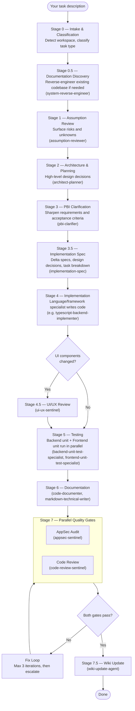
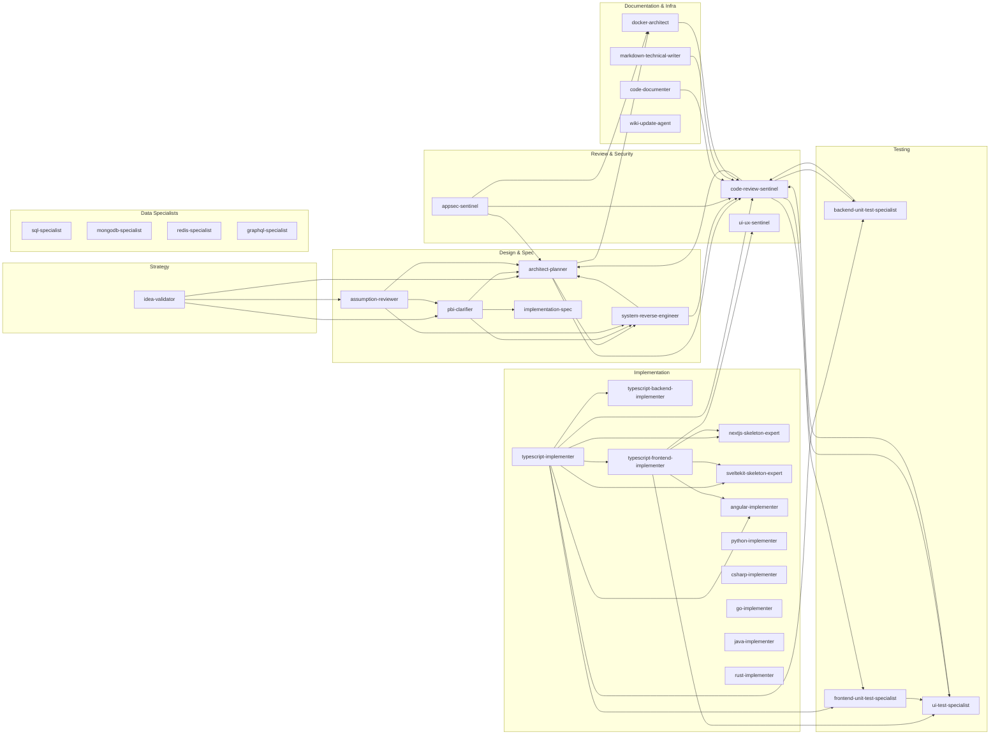

# AI Agent Workflows

A curated pack of custom AI agents and a modular skill library for VS Code and Cursor. The agents form a structured multi-stage pipeline — from raw idea to reviewed, tested, documented, and containerised code — using specialist agents that hand off to each other through well-defined contracts.

---

## Why this approach

Most AI-assisted development treats the AI as a single general-purpose tool. That works for simple tasks but breaks down for complex, real-world work where quality, security, and consistency matter.

This pack takes a different approach: **every stage of the development lifecycle has a dedicated specialist agent** with its own focused role, standards, and output contract. The `orchestrator` coordinates them in sequence, enforces quality gates, and retries failures before escalating to you.

**Key benefits:**

- **Separation of concerns** — Planners plan, implementers implement, reviewers review. Each agent excels at its narrow job instead of doing everything poorly.
- **Consistent quality gates** — The pipeline does not proceed to the next stage until the previous one passes. Security audits and code review run in parallel before any merge.
- **Reusable skill library** — Procedures, standards, and output contracts live in `skills/`, not duplicated across agent files. Update a skill once and all agents that reference it benefit immediately.
- **Team-wide consistency** — When the `agents/` and `skills/` folders live in your repo's `.github/` directory, every contributor uses the same pipeline with the same standards.
- **Escape hatches** — Use the full `orchestrator` pipeline for complex tasks, or invoke any specialist agent directly for targeted work (just need a security audit? run `appsec-sentinel` alone).

---

## How to get started

### Option 1 — Copy into your project (recommended for teams)

Copy `agents/` and `skills/` into the `.github/` folder of any repository. Every contributor who opens that repo in VS Code or Cursor will have the full pipeline available.

```
your-repo/
└── .github/
    ├── agents/         ← copy from this repo
    └── skills/         ← copy from this repo
```

```bash
# from the root of your target repo
cp -r /path/to/ai-agent-workflows/agents .github/agents
cp -r /path/to/ai-agent-workflows/skills .github/skills
```

> A CLI helper to automate this copy is planned for a future release.

### Option 2 — Machine-wide install (personal use)

Install agents into your VS Code or Cursor user prompts folder so they are available across all projects on your machine.

**Windows (PowerShell):**

```powershell
powershell -ExecutionPolicy Bypass -File .\installer\Setup.ps1
```

**macOS:**

```bash
bash ./installer/mac/setup.sh
```

Default install targets:

| Editor | Windows | macOS |
|--------|---------|-------|
| VS Code | `%APPDATA%\Code\User\prompts` | `~/Library/Application Support/Code/User/prompts` |
| Cursor | `%APPDATA%\Cursor\User\prompts` | `~/Library/Application Support/Cursor/User/prompts` |

### Option 3 — Node CLI installer

Cross-platform installer with an interactive wizard or scripted flags. Requires Node.js 20+ and `npm install` first.

```bash
# Interactive wizard
npm run pack:install

# Non-interactive — install to VS Code and Cursor, and copy skills into a project
npm run pack:install -- --yes --targets vscode,cursor --workspace /path/to/your/project
```

You can also install the CLI globally:

```bash
# Link from the repo (development)
npm link

# Then from anywhere
ai-agent-pack-install --yes --targets vscode,cursor --workspace /path/to/project
```

See [CLI reference](#cli-installer-reference) for all flags.

---

## How the pipeline works

### The orchestrator pipeline

Start the full pipeline by opening the `orchestrator` agent and describing your task. It classifies the work, selects the relevant stages, delegates to specialist agents, and enforces quality gates throughout.



Stages are skipped automatically based on task classification — Stage 6 is skipped for bug fixes, Stage 1 for trivial tasks, Stage 4.5 when no UI was touched, and so on.

### Agent handoffs (directed use)

You do not have to run the full pipeline. Every agent exposes handoff buttons after its response so you can jump to the right specialist with context already set.



Frontend routing is specialist-first: Next.js → `nextjs-skeleton-expert`, SvelteKit → `sveltekit-skeleton-expert`, Angular → `angular-implementer`, everything else → `typescript-frontend-implementer`. Data specialists follow the same post-implementation pattern: → `code-review-sentinel` → `backend-unit-test-specialist`.

---

## What's in the box

| Folder | Contents |
|--------|----------|
| `agents/` | 31 `*.agent.md` files — one per specialist plus the orchestrator |
| `skills/` | 32 `SKILL.md` files — procedures, standards, and output contracts by phase |
| `templates/` | 10 stack templates plus shared CI/CD workflows and governance contracts |
| `installer/` | Windows PowerShell and macOS shell scripts for machine-wide install/update/uninstall |
| `cli/` | Node/TypeScript pack installer with interactive wizard and scripted flags |

### Agent list

| Agent | Role | Phase |
|-------|------|-------|
| `orchestrator` | Full pipeline controller | All |
| `idea-validator` | Business idea validation | Pre-pipeline |
| `system-reverse-engineer` | Codebase discovery | 0.5 |
| `assumption-reviewer` | Risk and assumption surfacing | 1 |
| `architect-planner` | Architecture and planning | 2 |
| `pbi-clarifier` | Requirements clarification | 3 |
| `implementation-spec` | Delta specs and task breakdown | 3.5 |
| `typescript-implementer` | TS routing (delegates to specialists below) | 4 |
| `typescript-backend-implementer` | TypeScript backend | 4 |
| `typescript-frontend-implementer` | TypeScript frontend (generic fallback) | 4 |
| `nextjs-skeleton-expert` | Next.js | 4 |
| `sveltekit-skeleton-expert` | SvelteKit | 4 |
| `angular-implementer` | Angular | 4 |
| `python-implementer` | Python | 4 |
| `csharp-implementer` | C# / .NET | 4 |
| `go-implementer` | Go | 4 |
| `java-implementer` | Java | 4 |
| `rust-implementer` | Rust | 4 |
| `sql-specialist` | SQL / relational data | 4 |
| `mongodb-specialist` | MongoDB | 4 |
| `redis-specialist` | Redis | 4 |
| `graphql-specialist` | GraphQL | 4 |
| `ui-ux-sentinel` | UI/UX design review | 4.5 |
| `backend-unit-test-specialist` | Backend unit tests | 5a |
| `frontend-unit-test-specialist` | Frontend unit tests | 5b |
| `ui-test-specialist` | E2E / UI tests | 5c |
| `code-documenter` | In-code and API docs | 6 |
| `markdown-technical-writer` | Non-code docs and config files | 6 |
| `appsec-sentinel` | Security audit | 7a |
| `code-review-sentinel` | Code review | 7b |
| `wiki-update-agent` | Wiki update post-merge hook | 7.5 |
| `docker-architect` | Containerisation | Infra |

### Skills library

Skills are the authoritative source of procedures, standards, and output contracts. Agents are thin wrappers (~30–40 lines) that reference a skill — they do not duplicate its content. See [`skills/README.md`](skills/README.md) and [`skills/agent-to-skill-map.md`](skills/agent-to-skill-map.md) for the full mapping from agents to skills.

---

## CLI installer reference

Requires Node.js 20+ and `npm install` in this repo.

```bash
# Install to VS Code and Cursor (machine-wide)
npm run pack:install -- --yes --targets vscode,cursor

# Also copy skills into a project
npm run pack:install -- --yes --targets vscode --workspace /path/to/project

# Copy skills and templates into a project
npm run pack:install -- --yes --targets vscode --workspace /path/to/project --workspace-templates

# Preview without writing (dry run)
npm run pack:install -- --dry-run --yes --targets vscode
```

- **Registry**: [`cli/tools.registry.json`](cli/tools.registry.json) — tool IDs, labels, adapters, per-OS paths.
- **Adapters**: [`cli/lib/adapters.ts`](cli/lib/adapters.ts) — maps tool IDs to `vscode-agent` / `cursor-agent`. Add a row and adapter for other editors.
- **Manifest**: `install-manifest.json` written to the managed install root. Tracks installed files for safe uninstall.

---

## Windows installer

```powershell
# Install or refresh
powershell -ExecutionPolicy Bypass -File .\installer\Setup.ps1

# Update from latest repo
powershell -ExecutionPolicy Bypass -File .\installer\Update.ps1

# Remove installed files
powershell -ExecutionPolicy Bypass -File .\installer\Uninstall.ps1
```

Managed install root: `%LOCALAPPDATA%\ai-agent-workflows-pack`

Optional flags: `-InstallRoot`, `-SourceRepoPath`, `-VSCodePromptsPath`, `-CursorPromptsPath`, `-SkipVSCode`, `-SkipCursor`, `-Force`.

Build an MSI bundle (requires WiX v4+):

```powershell
powershell -ExecutionPolicy Bypass -File .\installer\msi\Build-Msi.ps1
```

---

## macOS installer

```bash
bash ./installer/mac/setup.sh
bash ./installer/mac/update.sh
bash ./installer/mac/uninstall.sh
```

Managed install root: `~/Library/Application Support/ai-agent-workflows-pack`

Optional flags: `--install-root`, `--source-repo-path`, `--vscode-prompts-path`, `--cursor-prompts-path`, `--skip-vscode`, `--skip-cursor`, `--force`.

Build a PKG bundle (requires Xcode command line tools):

```bash
bash ./installer/mac/pkg/build-pkg.sh
```

---

## Template projects baseline

Stack templates in `templates/` provide a consistent starting point for env vars, security, logging, feature flags, data mapping, reporting hooks, and CI/CD. Available stacks: Next.js, SvelteKit, Angular, backend service (generic), .NET, Python, Go, Java, Rust.

The **template parity validator** checks that all stacks implement required capabilities consistently:

```bash
npm install
npm run templates:validate-parity
```

Run this whenever `templates/**` files change to catch parity drift across framework variants.

### Wiki update post-task hook

After a Stage 7 PASS the orchestrator triggers `wiki-update-agent` to generate user-facing wiki content (functional changes and how-to guidance only — no internals). Output defaults to a PR with human approval required. Configured in [`templates/shared/wiki-update-contract.yaml`](templates/shared/wiki-update-contract.yaml).

---

## Phase output contracts

Chat-visible completion reports and append-only `agent-progress/` log templates are defined in [`Documentation/phase-output-contracts.md`](Documentation/phase-output-contracts.md). All agents produce output aligned to these contracts so progress is traceable across the full pipeline.
