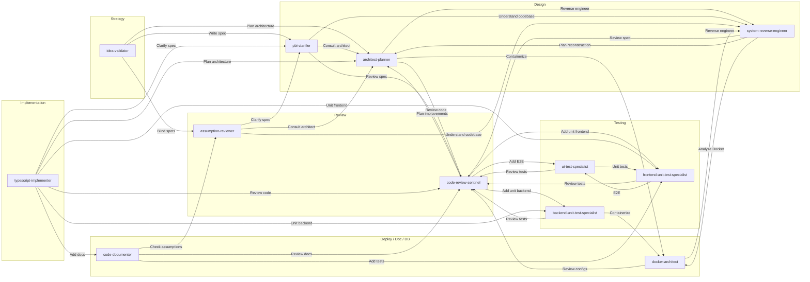

# cuddly-robot

A Repo of the custom Cursor or VS code Agents I have created.

## Agent Handoffs (Logical Flow)

Handoffs are defined in the YAML frontmatter (`handoffs:`) of each agent file. The diagram summarizes **outbound** handoffs between agents:

SQL, MongoDB, Redis, and GraphQL specialists follow the same pattern (→ code-review-sentinel, backend-unit-test-specialist, docker-architect or ui-test-specialist).
