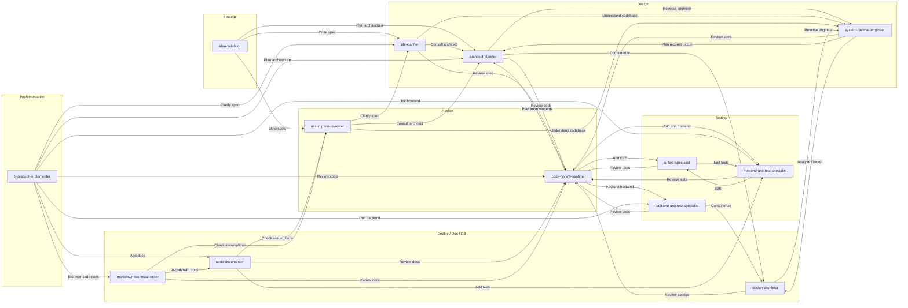

# AI Agent Workflows 

A Repo of the custom Cursor or VS Code Agents I have created.

## Quick Windows Installer

If you want a one-time install that places this pack directly into the Windows prompts folders used by VS Code and Cursor, use the scripts in `installer/`.

- `installer/Setup.ps1`: install or refresh the local pack
- `installer/Update.ps1`: update using the local repo beside the script (fallback: recorded manifest source repo)
- `installer/Uninstall.ps1`: remove installed payload and settings references

Default managed install root (manifest + metadata):

`%LOCALAPPDATA%\ai-agent-workflows-pack`

Default payload target paths:

- VS Code: `%APPDATA%\Code\User\prompts`
- Cursor: `%USERPROFILE%\.cursor\agents`

What gets installed per target:

- `VS Code/agents/*.agent.md` -> `<prompts-path>`
- `Templates/**` -> `<prompts-path>/Templates/**`

The installer writes `<install-root>/install-manifest.json` with source repo path, install root, package version, timestamp metadata, and a per-target file inventory for safe uninstall.

### Usage

Run from PowerShell in repo root:

```powershell
powershell -ExecutionPolicy Bypass -File .\installer\Setup.ps1
powershell -ExecutionPolicy Bypass -File .\installer\Update.ps1
powershell -ExecutionPolicy Bypass -File .\installer\Uninstall.ps1
```

Optional flags:

- `-InstallRoot "C:\some\custom\path"`
- `-SourceRepoPath "D:\ai-agent-workflows"` (Setup/Update)
- `-VSCodePromptsPath "C:\Users\<user>\AppData\Roaming\Code\User\prompts"` (Setup)
- `-CursorPromptsPath "C:\Users\<user>\.cursor\agents"` (Setup)
- `-SkipVSCode` (Setup)
- `-SkipCursor` (Setup)
- `-RemoveInstallRoot` (Uninstall, remove empty root folder)
- `-Force` (override safety checks where applicable)

### Build MSI Bundle

You can generate a bundled MSI (WiX v4+) that installs this pack and runs the quick setup script:

```powershell
powershell -ExecutionPolicy Bypass -File .\installer\msi\Build-Msi.ps1
```

Output is written to `installer/msi/out/AI-Agent-Workflows-Pack.msi` by default.

### Caveats

- Installer copies directly into prompts folders and does not edit editor settings JSON.
- Uninstall removes only files tracked in the manifest file inventory.
- MSI build requires WiX CLI (`wix`) available on `PATH`.

## Quick macOS Installer

If you want the same workflow on macOS, use scripts in `installer/mac/`.

- `installer/mac/setup.sh`: install or refresh agents/templates into prompts folders
- `installer/mac/update.sh`: re-run setup using the local repo beside the script (fallback: manifest source path)
- `installer/mac/uninstall.sh`: remove files recorded by installer metadata

Default managed install root:

- `~/Library/Application Support/ai-agent-workflows-pack`

Default prompts target paths:

- VS Code: `~/Library/Application Support/Code/User/prompts`
- Cursor: `~/Library/Application Support/Cursor/User/prompts`

What gets installed per target:

- `VS Code/agents/*.agent.md` -> `<prompts-path>`
- `Templates/**` -> `<prompts-path>/Templates/**`

Usage:

```bash
bash ./installer/mac/setup.sh
bash ./installer/mac/update.sh
bash ./installer/mac/uninstall.sh
```

Optional flags:

- `--install-root "/custom/path"`
- `--source-repo-path "/path/to/ai-agent-workflows"` (setup/update)
- `--vscode-prompts-path "/Users/<user>/Library/Application Support/Code/User/prompts"` (setup)
- `--cursor-prompts-path "/Users/<user>/Library/Application Support/Cursor/User/prompts"` (setup)
- `--skip-vscode` (setup)
- `--skip-cursor` (setup)
- `--remove-install-root` (uninstall)
- `--force` (setup/update/uninstall compatibility flag)

### Build macOS PKG Bundle

You can build a `.pkg` installer on macOS:

```bash
bash ./installer/mac/pkg/build-pkg.sh
```

Output path:

- `installer/mac/pkg/out/AI-Agent-Workflows-Pack-macOS.pkg`

Note: `pkgbuild` must be available (Xcode command line tools).

## Adding agents in Cursor and VS Code

### Cursor

Agents are loaded from the workspace. To use these agents in Cursor:

1. **Use this repo as your workspace** — Open the `cuddly-robot` folder in Cursor. The agents in `.vscode/agents/` (files named `*.agent.md`) appear in the agent picker in Chat (e.g. Cmd/Ctrl+I or the agent dropdown).
2. **Use in another project** — Copy the `.vscode/agents` folder from this repo into your project’s `.vscode/` directory. After you open that project in Cursor, the agents show up in the picker.

No extra config is required; Cursor discovers `.agent.md` files under `.vscode/agents/` in the open workspace.

### VS Code (with Copilot / AI chat)

VS Code custom agents use the same `.agent.md` format but look in different places by default:

1. **Default location** — VS Code looks for custom agents in **`.github/agents`** in your workspace (not `.vscode/agents`). To use this repo’s agents in a project:
   - Copy the contents of this repo’s `.vscode/agents/` into your project’s **`.github/agents/`** (create the folder if needed), or
   - Keep the files as `.agent.md`; only the folder path differs.
2. **Custom agent locations** — To load agents from another path (e.g. this repo or a shared folder), set **`chat.agentFilesLocations`** in VS Code settings (or `chat.copilot.chat.agentFilesLocations` depending on your version) to include that path. Then VS Code will discover `.agent.md` files there as well.

To manage agents: run **“Chat: Open Chat Customizations”** from the Command Palette, or type `/agents` in chat. You can show/hide agents in the dropdown from there.

---

## Flows

### 1. Specialist handoffs (agent-to-agent)

Agents can hand off to other agents via the **handoffs** defined in each agent’s YAML frontmatter. The diagram below summarizes **outbound** handoffs between specialists (strategy → design → review → implementation → testing → deploy/doc). Use the handoff buttons that appear after a response to move to the next agent with context and a pre-filled prompt.

Documentation scope is split intentionally:
- `code-documenter` handles in-code and API reference documentation.
- `markdown-technical-writer` handles non-code docs/config/agent files.

### 2. Full pipeline (orchestrator)

The **orchestrator** agent runs the full pipeline for a task: validate → plan → clarify → implement → test → document → review → fix. It delegates to specialist agents in sequence and enforces quality gates. For the full stage-by-stage flow, gates, and escalation rules, see **[Implementation/orchestrator.md](Implementation/orchestrator.md)**.

Pipeline timing note:

- Pipeline run timing is tracked as the duration of the orchestration session (from the first stage entry to the final stage entry).
- It is not intended as a benchmark of command execution speed at each individual step.

---

## Agent Handoffs (Logical Flow)

Handoffs are defined in the YAML frontmatter (`handoffs:`) of each agent file. The diagram summarizes **outbound** handoffs between agents:



SQL, MongoDB, Redis, and GraphQL specialists follow the same pattern (→ code-review-sentinel, backend-unit-test-specialist, docker-architect or ui-test-specialist).

---

## Template Projects Baseline

If you want repeatable, consistent project starts, use the template system in `Templates/`:

- `Templates/frontend-web/template-spec.yaml`
- `Templates/frontend-nextjs/template-spec.yaml`
- `Templates/frontend-sveltekit/template-spec.yaml`
- `Templates/frontend-angular/template-spec.yaml`
- `Templates/backend-service/template-spec.yaml`
- `Templates/backend-dotnet/template-spec.yaml`
- `Templates/backend-python/template-spec.yaml`
- `Templates/backend-go/template-spec.yaml`
- `Templates/backend-java/template-spec.yaml`
- `Templates/backend-rust/template-spec.yaml`
- `Templates/shared/platform-contracts.yaml`
- `Templates/shared/capability-parity-matrix.yaml`
- `Templates/shared/stack-catalog.yaml`
- `Templates/shared/wiki-update-contract.yaml`
- `Templates/shared/ci-command-contract.yaml`
- `Templates/shared/ci-stack-command-matrix.yaml`
- `Templates/shared/workflows/ci-pr.yaml`
- `Templates/shared/workflows/ci-main.yaml`
- `Templates/shared/workflows/cd-release.yaml`
- `Templates/shared/workflows/cd-deploy.yaml`
- `VS Code/agents/wiki-update-agent.agent.md`
- `Templates/scaffold-prompt.md`

This provides a common baseline for env vars, security, logging, data mapping, feature flags, reporting hooks, and admin dashboard integration points so teams stop re-solving the same setup per project.

### Template Parity Validator

The file `Templates/tools/validate-parity.ts` is repository tooling, not an application definition. It validates template governance across:

- Stack coverage between `Templates/shared/stack-catalog.yaml` and `Templates/shared/capability-parity-matrix.yaml`
- Required capability coverage in each stack template spec
- CI command contract completeness from `Templates/shared/ci-command-contract.yaml`
- Stack command matrix coverage from `Templates/shared/ci-stack-command-matrix.yaml`
- Required reusable workflow templates in `Templates/shared/workflows/`
- Unit and E2E starter metadata presence/alignment in stack template specs
- Parity evidence schema compliance (`Templates/shared/parity-evidence-schema.yaml`)

Reusable workflow templates resolve stack commands through slot names:

- CI order is fixed: `install -> lint -> build -> unit_test -> e2e_test`
- CD templates use `package` and `deploy` slots
- Backend E2E baseline is API smoke/integration (not browser-only)

### Wiki Update Post-Task Flow

The orchestrator includes a post-review hook for wiki updates after Stage 7 PASS.

- Scope defaults: `github.com` plus GHES allowlist in `Templates/shared/wiki-update-contract.yaml`
- Trigger default: `stage7_pass`
- Output mode default: `pr`
- Approval default: `humanApproval: true`
- Failure semantics: non-blocking warning + audit (does not fail pipeline)

The `wiki-update-agent` generates user-facing content only:

- Include: functional changes and end-user how-to guidance
- Exclude: low-level technical internals and refactor-only details

When host is unsupported or the candidate is not documentation-worthy, the wiki flow is skipped with audit metadata.

Run it from the repo root:

```bash
npm install
npm run templates:test-parity
npm run templates:validate-parity
```

Use this check whenever `Templates/**` files change to prevent parity drift across framework and language variants.
